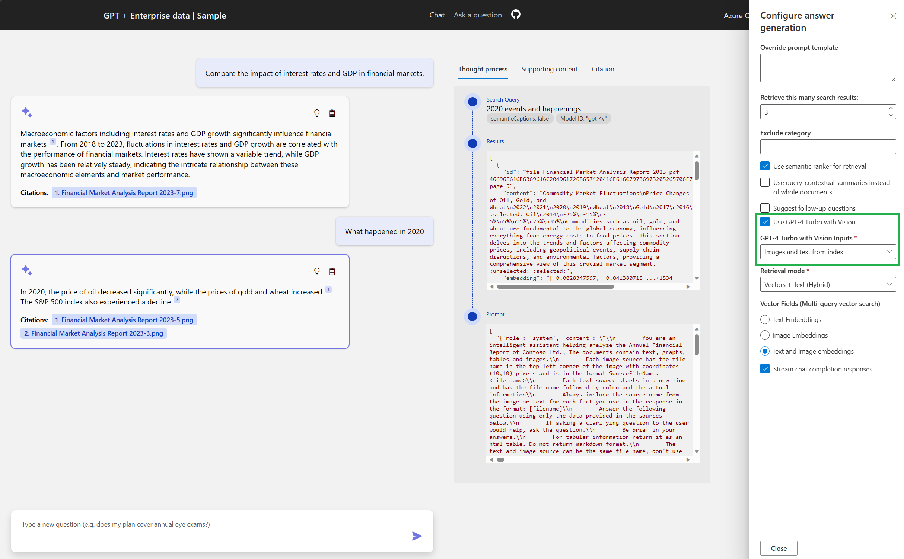

# Enabling GPT-4 Turbo with Vision

This repository now includes an example of integrating GPT-4 Vision with Azure AI Search. This feature enables indexing and searching images and graphs, such as financial documents, in addition to text-based content.

## Feature Overview

- **Document Handling:** Source documents are split into pages and saved as PNG files in blob storage. Each file's name and page number are embedded for reference.
- **Data Extraction:** Text data is extracted using OCR.
- **Data Indexing:** Text and image embeddings, generated using Azure AI Vision ([Azure AI Vision Embeddings](https://learn.microsoft.com/en-us/azure/ai-services/openai/how-to/embeddings?tabs=console)), are indexed in Azure AI Search along with the raw text.
- **Search and Response:** Searches can be conducted using vectors or hybrid methods. Responses are generated by GPT-4 Turbo Vision based on the retrieved content.

## Getting Started

### Prerequisites
- If using Azure Open AI Ensure your subscription has access to create a GPT 4 turbo with vision model.
- Ensure you can deploy in a region where all required components are available
    - Azure Open AI models  
        - gpt-35-turbo
        - text-embedding-ada-002
        - gpt-4v

    - [Azure AI Vision](https://learn.microsoft.com/en-us/azure/ai-services/computer-vision/)

### Setup and Usage

1. **Update Repository:**
   Pull the latest changes.

2. **Enable GPT-4 Vision:**
   Set the environment variable with `azd Env set USE_GPT4V=true`. This flag is used to deploy necessary components for vision fuctionality and to toggle UI components.

3. **Clean Old Deployments (optional):**
   Run `azd down --purge` for a fresh setup.

4. **Start the Application:**
   Execute `azd up` to build, provision, deploy, and initiate document preparation.

5. **Web Application Usage:**
    
   - Access the developer options in the web app and select "USE GPT-4V".
   - Sample questions will be updated for testing.
   - Interact with the questions to view responses.
   - The 'Thought Process' tab shows the retrieved data and its processing by GPT4V.

Feel free to explore and contribute to enhancing this feature. For questions or feedback, use the repository's issue tracker.
